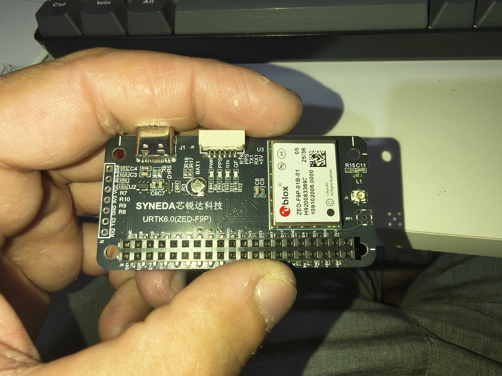
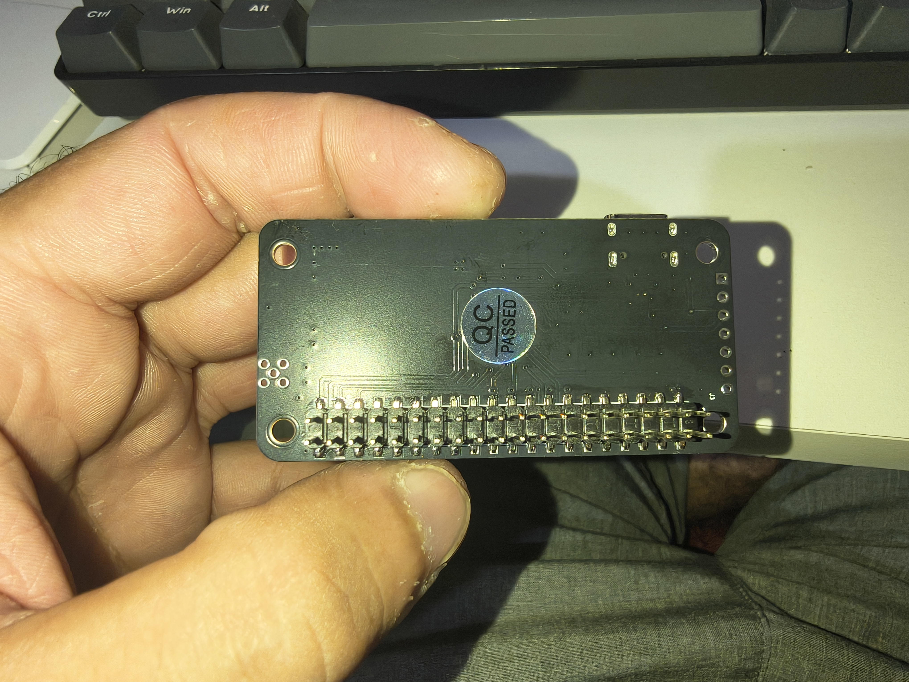
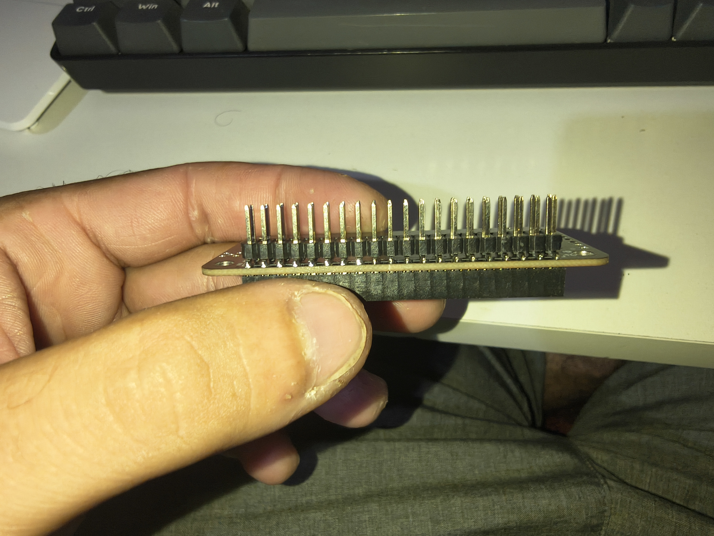

# SYNEDA URTK6 ZED-F9P KiCad Project

Projeto KiCad para a placa **SYNEDA URTK6.0 (ZED-F9P)**.

Este repositório contém símbolo, footprint e projeto KiCad para integração da placa URTK6 com módulo GNSS **u-blox ZED-F9P**.

## Fotos da placa

## Conteúdo

- `SYNEDA_Footprints.pretty/URTK6_ZEDF9P_RPIZERO_2X20_RND.kicad_mod`
- `SYNEDA_Symbols.kicad_sym`
- `URTK6_ZEDF9P_Carrier.kicad_pro`
- `URTK6_ZEDF9P_Carrier.kicad_sch`
- `URTK6_ZEDF9P_Carrier.kicad_pcb`
- `docs/PINOUT.md`
- `docs/FOOTPRINT_NOTES.md`

## Bibliotecas KiCad

Símbolo:

- `SYNEDA_SYM:URTK6_ZEDF9P_RPIZERO_2X20_RND`

Footprint:

- `SYNEDA_FP:URTK6_ZEDF9P_RPIZERO_2X20_RND`

## Características do footprint

- Placa: **65,0 x 32,5 mm**
- Furos: **58,0 x 23,5 mm**
- Header principal 2x20:
  - corpo aproximado: **51,2 x 5,0 mm**
  - offset da aresta esquerda: **7,7 mm**
  - offset da aresta inferior: **1,6 mm**
  - pinos distribuídos no espaçamento padrão Raspberry Pi
- Header auxiliar lateral:
  - corpo aproximado: **2,3 x 19,4 mm**
  - offset da aresta inferior: **7,5 mm**
  - alinhado com a aresta esquerda
- USB:
  - **9,0 x 7,5 mm**
  - offset da aresta esquerda: **8,0 mm**
  - topo alinhado com a aresta superior da placa
- J1:
  - **11,0 x 4,0 mm**
  - offset de **6,5 mm** em relação ao USB

## Pinos exibidos no símbolo

O símbolo mostra apenas os sinais úteis de integração:

- `VCC`
- `3V3`
- `GND`
- `SDA`
- `SCL`
- `TX2`
- `RX2`
- `J1_RTK`
- `J1_PPS`
- `J1_TX1`
- `J1_RX1`
- `J1_VCC`

Os demais pinos do header 2x20 permanecem indicados no footprint como referência física.

## Pads internos compartilhados

| Barramento | Pad usado |
|---|---:|
| VCC / 5V | `1` |
| 3V3 | `2` |
| GND | `5` |
| SCL / AUX SCL | `4` |
| SDA / AUX SDA | `6` |

## Instalação em outro projeto KiCad

Copie estes itens para o novo projeto:

- `SYNEDA_Symbols.kicad_sym`
- `SYNEDA_Footprints.pretty/`
- `sym-lib-table`
- `fp-lib-table`

Ou registre manualmente:

Biblioteca de símbolos:

- Nome: `SYNEDA_SYM`
- Caminho: `${KIPRJMOD}/SYNEDA_Symbols.kicad_sym`

Biblioteca de footprints:

- Nome: `SYNEDA_FP`
- Caminho: `${KIPRJMOD}/SYNEDA_Footprints.pretty`

## Antes de fabricar

Conferir no KiCad e na placa real:

- posição do header 2x20
- posição do header AUX 7 pinos
- furos de fixação
- contorno arredondado
- USB
- J1
- pinagem elétrica
- ERC
- DRC

## Status

Versão inicial validada visualmente com base em foto e medições manuais. Antes de produção, conferir todas as medidas críticas com paquímetro.
